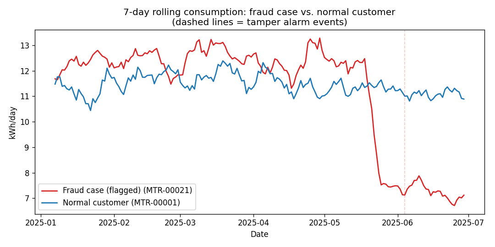
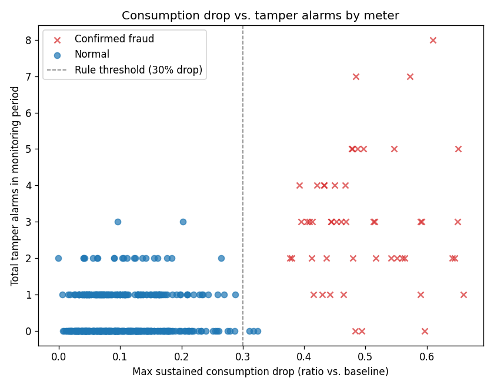
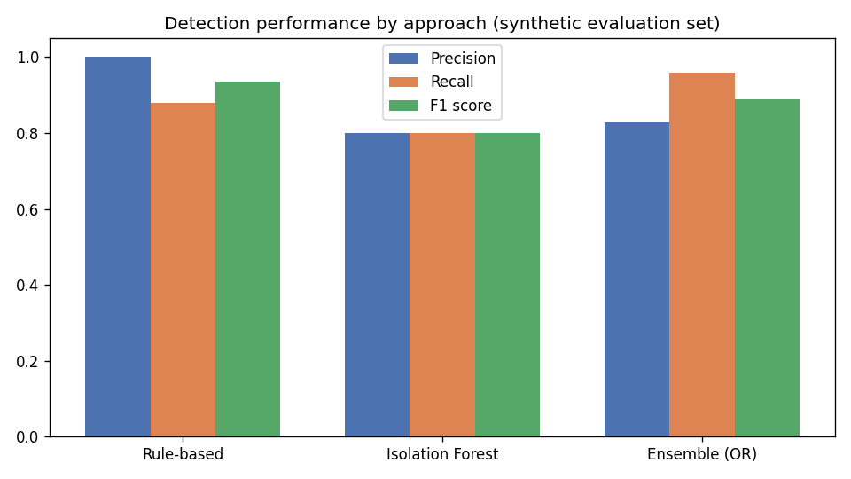

# Energy Theft Detection — Non-Technical Loss Analysis

Detecting likely energy theft in an electric utility's distribution network
by correlating smart meter tamper alarms with anomalous drops in
consumption — combining a rule-based detection method with an unsupervised
machine learning model.

## ⚠️ Data Disclosure

**The dataset in this repository is synthetic**, generated by
[`src/data_generation/generate_synthetic_data.py`](src/data_generation/generate_synthetic_data.py)
to statistically resemble the shape of real utility data, without exposing
any real customer, meter, or company information. The methodology and the
real-world problem it addresses are real (see below); the specific data
points and the quantitative results in this README are from this synthetic
reproduction, not from a production system.

## Real-World Context

## Real-World Context

While working on the loss-reduction program of a national electric utility, I co-designed this detection approach with the team: correlating smart meter tamper alarms (tilt, magnetic tamper, cover-open) with consumption anomalies to flag likely energy theft. Confirmed cases were fed into the utility's loss-reduction efforts. We later iterated the production alarm logic around a season-aware, per-customer consumption baseline, which cut theft-detection false positives by ~35%.

This repository rebuilds the core approach from scratch on synthetic data and extends it with a machine learning model for comparison. The production metric above is not reproduced here — every number below comes from the synthetic dataset. Full technical detail in [docs/methodology.md](docs/methodology.md).

## What This Repository Demonstrates

1. **Rule-based detection** — the original methodology: flag a meter with a
   sustained consumption drop *and* a tamper alarm in the same window.
2. **Unsupervised anomaly detection** (Isolation Forest) as an ML extension,
   catching cases the rule-based method misses when no alarm fired.
3. **An ensemble comparison**, showing the classic precision/recall
   trade-off between a conservative rule and a noisier ML model.
4. **Synthetic data generation** designed to mimic real utility data
   patterns, fully reproducible from a fixed random seed.

## Results (synthetic evaluation set — 500 meters, 50 confirmed fraud cases)

| Approach | Precision | Recall | F1 | Flagged |
|---|---|---|---|---|
| Rule-based (drop + alarm) | 1.000 | 0.880 | 0.936 | 44 |
| Isolation Forest | 0.800 | 0.800 | 0.800 | 50 |
| Ensemble (rule OR model) | 0.828 | 0.960 | 0.889 | 58 |

**Interpretation:** the rule-based method almost never sends a false lead to
the field team (precision 1.0), but misses 6 of 50 fraud cases where the
alarm never fired or wasn't logged. The Isolation Forest model catches more
of those "quiet" cases by reading the consumption pattern alone, at the
cost of more false positives. Combining both pushes recall to 0.96 — in
fraud detection, sending a field crew to check a few extra false leads is
usually cheaper than missing a real theft case that keeps costing the
utility money every month.





## Repository Structure

```
energy-theft-detection/
├── data/
│   ├── raw/              # synthetic meters, consumption, alarms
│   └── processed/        # engineered features, ground truth (eval-only)
├── notebooks/
│   └── analysis.ipynb    # full walkthrough with results and charts
├── src/
│   ├── data_generation/  # synthetic data generator
│   ├── features/         # feature engineering
│   ├── models/           # rule-based + Isolation Forest
│   └── utils/            # chart generation
├── docs/
│   └── methodology.md    # technical detail + real-world context
├── outputs/               # generated charts and result CSVs
└── requirements.txt
```

## How to Run

```bash
python -m venv venv && source venv/bin/activate   # optional but recommended
pip install -r requirements.txt

python src/data_generation/generate_synthetic_data.py   # generates data/raw + ground truth
python src/features/build_features.py                   # generates data/processed/features.csv
python src/models/rule_based.py                          # rule-based results
python src/models/anomaly_detection.py                   # Isolation Forest + ensemble results
python src/utils/make_charts.py                           # regenerates the charts above

jupyter notebook notebooks/analysis.ipynb                 # or open the full walkthrough
```

All results are reproducible: the data generator uses a fixed random seed
(42), so re-running the pipeline produces identical numbers.

## Tech Stack

Python · pandas · scikit-learn · matplotlib · Jupyter

## Status

Core pipeline complete: data generation, feature engineering, rule-based
detection, Isolation Forest model, and evaluation are all implemented and
reproducible. Possible next steps: a Grafana dashboard for real-time
monitoring (the tool actually used in the original ENEE implementation),
and calibrating thresholds per zone instead of globally.

## License

MIT — see [`LICENSE`](LICENSE).
